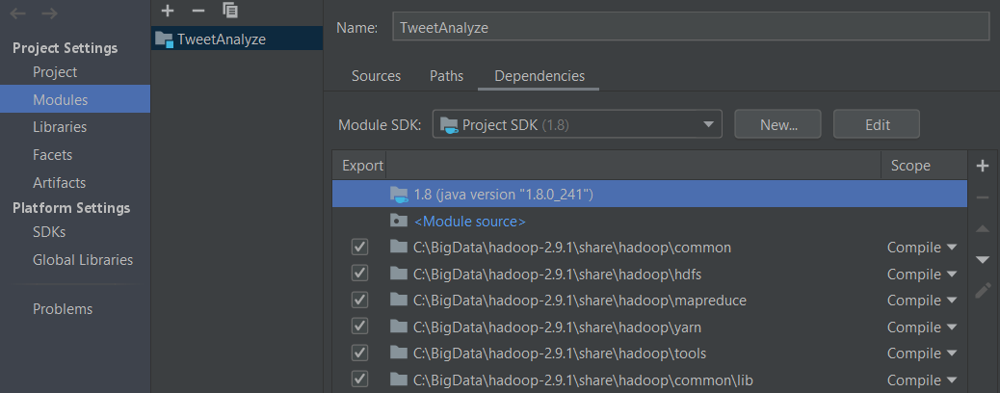

# Tweet Analyze

##  Setup
You should use IntelliJ IDEA to easily run this project and Java 1.8.x edition.

- To add hadoop dependencies follow the instruction
* File -> Project Structure -> Modules -> Dependencies
* Click + sign then select "Jar or directories" and add hadoop dependencies.


## Running

Don't forget to run IntelliJ IDEA with **administrator** permission.

To run the program again, you have to **delete the output folder**.

_To run easily follow the instruction_

* RUN -> Edit Configurations
* click + select Application
* Fill the setting like this


## Project Details

The main goal of the _TweetRetrieval_ is calculate the Term Frequency (TF) and Inverse Document Frequency (IDF).

_n_ is the word count of the document.

_N_ is total word count of the document.

_m_ is total count of the word in the corpus.

_D_ is the count of documents in corpus.

_TF*IDF = n/N * log(D/m)_
 
### TASK 1

In Task-1, the word frequency in the documents is calculated. It takes inputs from documents under the input folder. 
It prints the output to the task-1 under the output folder. 
    
   * To convert words to lowercase according to the Turkish language
     ```
     Locale TURKISH = Locale.forLanguageTag("tr");
     word.toLowerCase(TURKISH);
     ```
   * To remove URLs which are starts with https://
     ```
     word.replaceAll("https://[-a-zA-Z0-9çıöşüğ+&@#/%?=~_|!:,.;]*", " ");
     ```
   * To remove word which is smaller than three character.
     ```
     word.replaceAll("\\b[\\wçıöşüğ]{1,2}\\b", " ");
     ```
   * Output is
     ```
     word + "\t" + filename+ "\t" + n
     ```

### TASK 2
 
 In Task-2, the total word count of a document is calculated using Task-1 output.

The _WordCount_ class created so that data from the previous task can be stored. Thanks to the statically generated Java Map Object, it is transferred to the list during the map operation, then the obtaining result and the data in the list will be the next output.

   * To add new WordCount to WordCountMap
     ```
     WordCountMap.addWordCount(word,docName,n);
     ```
   * Output is
     ```
     word + "\t" + filename + "\t" + n + "\t" + N
     ```
### TASK 3
In Task-3, the total count of word in the corpus is calculated using Task-2 output. 
  
   * To add WordCount to WordFrequencyMap
     ```
     WordFrequencyMap.addWordFrequency(word,docName,n,N);
     ```
   * Output is
     ```
     word + "\t" + filename + "\t" + n + "\t" + N + "\t" + m
     ```
### TASK 4
In Task-4, the TF*IDF is calculated using Task-3 output. 

   * TF*IDF calculation
     ```
     TF_IDF = n/N * log(D/m)
     ```
   * Output is
     ```
     word + "\t" + filename + "\t" + TF_IDF
     ```
#### Useful links

You can check for hadoop with IntelliJ IDEA

[Using Hadoop with IntelliJ IDEA](https://intellij-support.jetbrains.com/hc/en-us/community/posts/206250189-Using-IntelliJ-to-develop-Hadoop-jobs)

[Windows Hadoop Installation](https://exitcondition.com/install-hadoop-windows/)