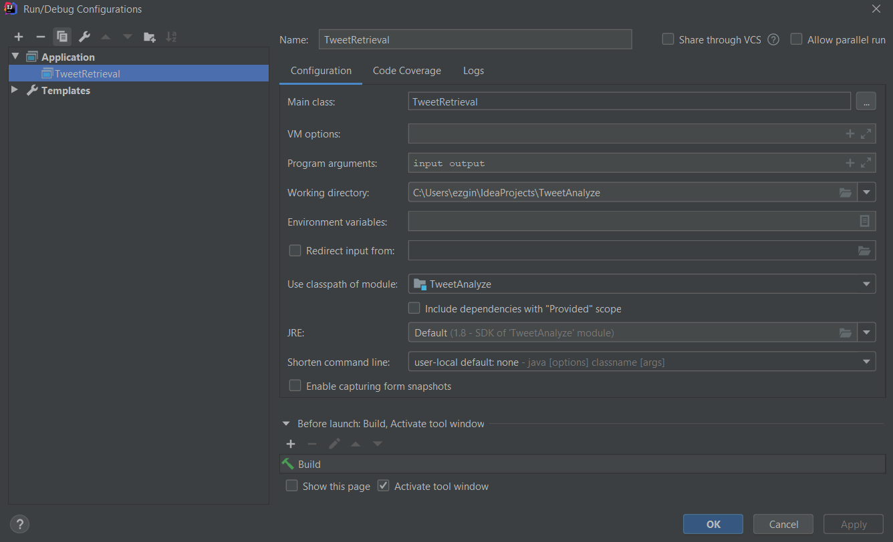

# Tweet Analyze

##  Setup
You should use IntelliJ IDEA to easily run this project and Java 1.8.x edition.

- To add hadoop dependencies follow the instruction
* File -> Project Structure -> Modules -> Dependencies
* Click + sign then select "Jar or directories" and add hadoop dependencies.

## Running

- To run easily follow the instruction

* RUN -> edit configurations
* click + select application
* Fill the setting like this

### Usefull links

You can check for hadoop with IntelliJ IDEA
[Using Hadoop with IntelliJ IDEA](https://intellij-support.jetbrains.com/hc/en-us/community/posts/206250189-Using-IntelliJ-to-develop-Hadoop-jobs)
